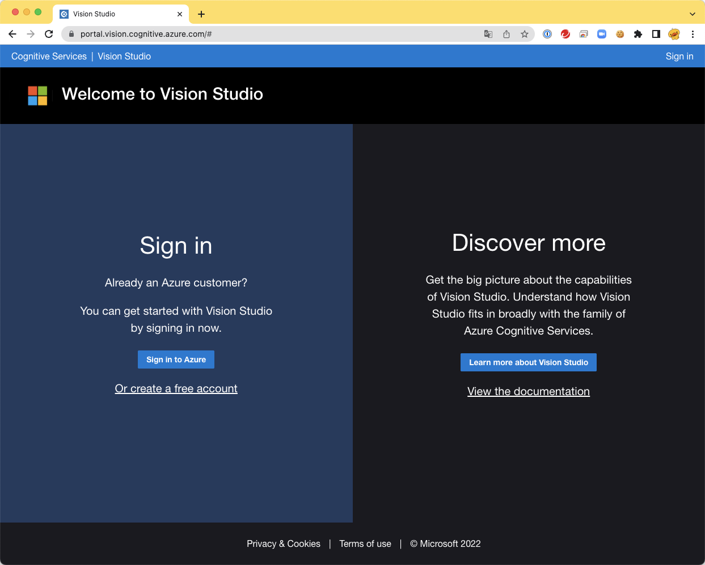
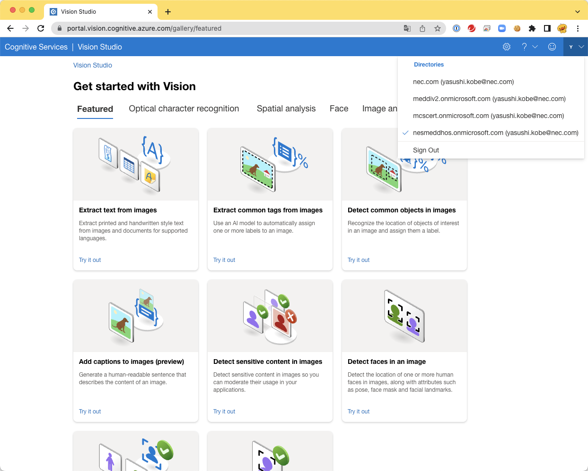
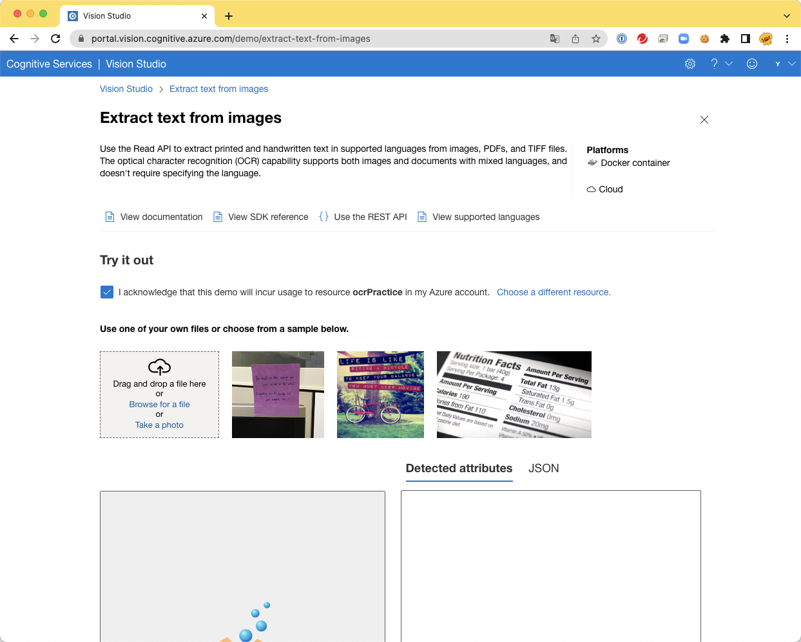
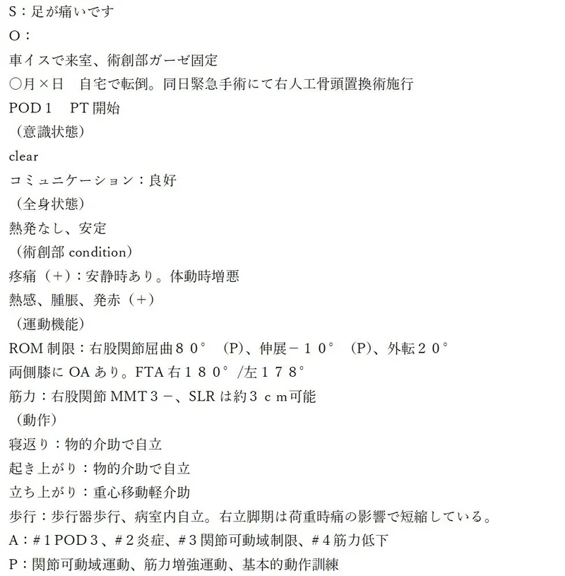
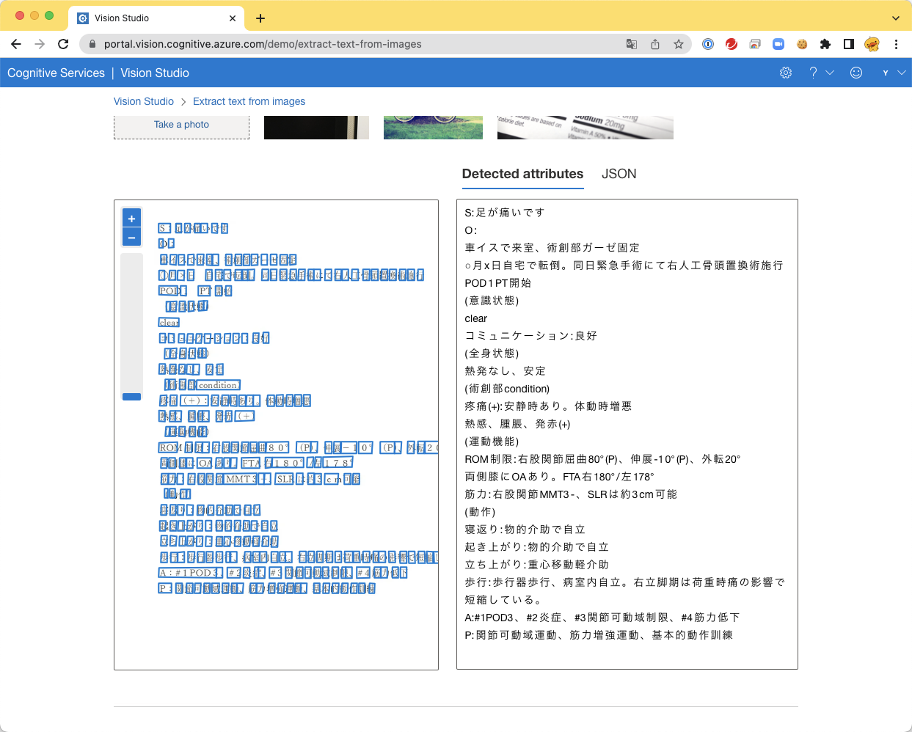
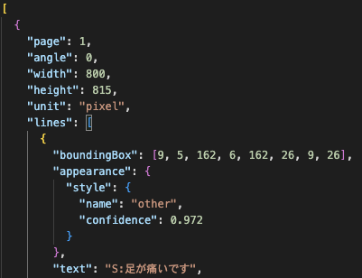
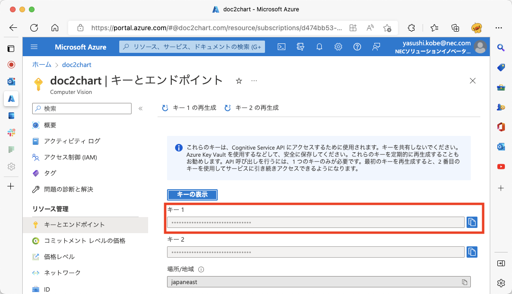
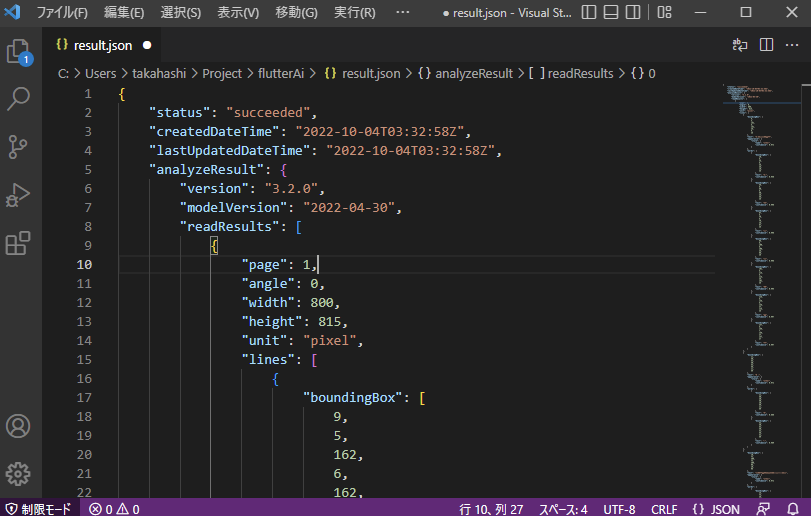

# Azure AI

## Vision Studio を使ってみる。

- https://portal.vision.cognitive.azure.com に接続します。  

    
  <br/>

- `Sign in to Azure` より Sign in を進めます。  

    
  ログインができました。  
  複数のAzureアカウントを持っている方は、実行対象のアカウントに変更します。  
  <br/>

- `Extract text from images` を選択します。  

    
  この画面の中では、`RESOURCE`を選択します。 存在しない方は、作成を進めます。  
  この例では、`ocrPractice`というリソースが選択されています。  
  <br/>

- OCR対象のファイルを準備します。

    
  このファイルを、Vision StudioのDrag and dropエリアにドラッグをします。  
  <br/>

- OCR Scan結果が表示されます。  
  
    
  <br/>

- Result JSON Dataを観察してみましょう。  
  
    
  [result.json](./result.json)
  このように、行・列情報、信頼度、テキスト情報が構造化されて返却されています。  

## REST API

この動作は、[REST API](https://westus.dev.cognitive.microsoft.com/docs/services/computer-vision-v3-2/operations/5d986960601faab4bf452005)でも稼働させることができます。  

### URL

```curl
https://{endpoint}/vision/v3.2/read/analyze[?language][&pages][&readingOrder][&model-version]
```

### parameter

parameter|type|description
---|---|---
language (optional)|string|See https://aka.ms/ocr-languages for list of supported languages.
pages (optional)|string|The page selection only leveraged for multi-page PDF and TIFF documents. Accepted input include single pages (e.g.'1, 2' -> pages 1 and 2 will be processed), finite (e.g. '2-5' -> pages 2 to 5 will be processed) and open-ended ranges (e.g. '5-' -> all the pages from page 5 will be processed & e.g. '-10' -> pages 1 to 10 will be processed). All of these can be mixed together and ranges are allowed to overlap (eg. '-5, 1, 3, 5-10' - pages 1 to 10 will be processed). The service will accept the request if it can process at least one page of the document (e.g. using '5-100' on a 5 page document is a valid input where page 5 will be processed). If no page range is provided, the entire document will be processed.
readingOrder (optional)|string|Optional parameter to specify which reading order algorithm should be applied when ordering the extract text elements. Can be either 'basic' or 'natural'. Will default to basic if not specified
model-version (optional)|string|Optional parameter to specify the version of the OCR model used to extract text information for the image/document submitted. Accepted values are: "latest", "2022-04-30", "2022-01-30-preview", "2021-09-30-preview", "2021-04-12". Defaults to latest if not provided.

### header

header|type|description
---|---|---
Content-Type|string|Media type of the body sent to the API.
Ocp-Apim-Subscription-Key|string|Subscription key which provides access to this API. Found in your Cognitive Services accounts.

### body

Input passed within the POST body. Supported input methods: raw image binary or image URL.

<u>Input requirements:</u>

* Supported image formats: JPEG, PNG, BMP, PDF and TIFF.
* Please do note MPO (Multi Picture Objects) embedded JPEG files are not supported.
* For multi-page PDF and TIFF documents:
* For the free tier, only the first 2 pages are processed.
* For the paid tier, up to 2,000 pages are processed.
* Image file size must be less than 50 MB (4 MB for the free tier).
* The image/document page dimensions must be at least 50 x 50 pixels and at most 10000 x 10000 pixels.

### Response 202

The service has accepted the request and will start processing soon. The client can query the operation status and result by using the Operation Id from the 'Operation-Location' response header value, a URL. In the following example, the Operation Id is 49a36324-fc4b-4387-aa06-090cfbf0064f, to be used as the ‘operationId’ parameter to the Get Read Results operation, The URL expires in 24 hours.

Response Header Key|Value
---|---
Operation-Location|Operation status and result URL.<br/>Example: https://cognitiveservice/vision/v3.2/read/analyzeResults/49a36324-fc4b-4387-aa06-090cfbf0064f

<u>Sample Response Header</u>

```text
Content-Length: 0 
Operation-Location: https://japaneast.api.cognitive.microsoft.com/vision/v3.2/read/analyzeResults/08f557b9-c915-4c0d-a1ba-4648a4405195 
CSP-Billing-Usage: CognitiveServices.ComputerVision.Transaction=1 
apim-request-id: 08f557b9-c915-4c0d-a1ba-4648a4405195 
Date: Fri, 04 Sep 2020 10:11:18 GMT
```

## CURLで実習

### CURLコマンド導入

Windowsターミナルを管理者モードで起動し、コマンドプロンプトを起動します。

```cmd
choco install curl
```

### CURL動作確認

下記内容が表示されれば、正常に動作しています。  

```text
$ curl https://google.com
<HTML><HEAD><meta http-equiv="content-type" content="text/html;charset=utf-8">
<TITLE>301 Moved</TITLE></HEAD><BODY>
<H1>301 Moved</H1>
The document has moved
<A HREF="https://www.google.com/">here</A>.
</BODY></HTML>
```

### OCR解析コマンド発行

#### エンドポイントを記録

  

上記``エンドポイント``情報を控えます。  

#### APIキーを記録

  

上記``キー１``情報を控えます。  


#### 解析コマンド発行

コマンドプロンプトより実行します。  
エンドポイントをURLに指定します。
`Ocp-Apim-Subscription-Key` には、APIキーを設定します。  

```cmd
curl -i https://xxxxxxxx.xxxx.xxxx.xxx/vision/v3.2/read/analyze\?language\=ja ^
-H "Content-Type: image/png" ^
-H "Ocp-Apim-Subscription-Key: xxxxxxxx" ^
--data-binary "@ocr.png"
```

#### 解析コマンド実行結果

```text
HTTP/1.1 202 Accepted
Content-Length: 0
Operation-Location: https://doc2chart.cognitiveservices.azure.com/vision/v3.2/read/analyzeResults/xxxxxxxx-xxxx-xxxx-xxxx-xxxxxxxx
x-envoy-upstream-service-time: 133
CSP-Billing-Usage: CognitiveServices.ComputerVision.Transaction=1
apim-request-id: 7fe71f4a-bae8-4077-a0a4-279282329a34
Strict-Transport-Security: max-age=31536000; includeSubDomains; preload
x-content-type-options: nosniff
Date: Tue, 04 Oct 2022 03:32:57 GMT
```

#### 解析結果取り出し

解析コマンド実行時の`Operation-Location`ヘッダーの値を利用して、結果取り出しを行う。  
`Ocp-Apim-Subscription-Key` には、APIキーを設定します。  

```cmd
curl https://doc2chart.cognitiveservices.azure.com/vision/v3.2/read/analyzeResults/xxxxxxxx-xxxx-xxxx-xxxx-xxxxxxxx ^
-H "Ocp-Apim-Subscription-Key: xxxxxxxxxx" > result.json
```

#### 解析結果参照

```cmd
code result.json
```

`shift` + `ALT` + `F` で Formatting

  

