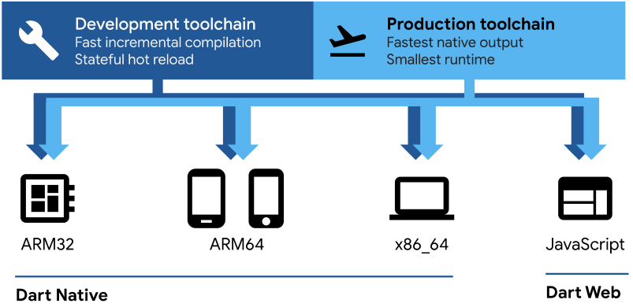

# Dart言語

  

## Dart: プラットフォーム

Dart のコンパイラ テクノロジを使用すると、さまざまな方法でコードを実行できます。

* ネイティブ プラットフォーム: モバイル デバイスとデスクトップ デバイスをターゲットとするアプリの場合、Dart には、ジャスト イン タイム (JIT) コンパイルを備えた Dart VM と、マシン コードを生成するための事前 (AOT) コンパイラの両方が含まれています。
* Web プラットフォーム: Web をターゲットとするアプリの場合、Dart は開発または運用目的でコンパイルできます。その Web コンパイラは、Dart を JavaScript に変換します。

  

Flutter フレームワークは、Dart プラットフォームを利用した人気のあるマルチプラットフォーム UI ツールキットであり、iOS、Android、macOS、Windows、Linux、およびウェブで実行される UI エクスペリエンスを構築するためのツールと UI ライブラリを提供します。

### Dart ネイティブ (マシンコード JIT および AOT)

<u>開発中、イテレーションには迅速な開発者サイクルが重要です。</u> Dart VM は、増分再コンパイル (ホット リロードを有効にする)、ライブ メトリック コレクション ( DevToolsを強化する)、豊富なデバッグ サポートを備えたジャストインタイム コンパイラ (JIT) を提供します。

アプリを本番環境にデプロイする準備ができたら (アプリ ストアに公開する場合でも、本番環境のバックエンドにデプロイする場合でも)、Dart 事前 (AOT) コンパイラーは、ネイティブの ARM または x64 マシン コードにコンパイルできます。<u>AOT でコンパイルされたアプリは、一貫した短い起動時間で起動します。</u>

AOT でコンパイルされたコードは、効率的な Dart ランタイム内で実行されます。このランタイムは、健全な Dart 型システムを適用し、高速なオブジェクト割り当てと 世代別ガベージ コレクターを使用してメモリを管理します。

## Dart文法

1. [Hello World](https://dartpad.dev/?id=88e4f53e09fdccfb75d68126c985656a)
2. [関数](https://dartpad.dev/?id=e7abc21effaa67b46370a2ac814e9229)
3. [コレクション](https://dartpad.dev/?id=15815a0478e4ed63b88d136ca9280b51)
4. [条件・ループ](https://dartpad.dev/?id=9a09a8beb40351605aba7d3ff9fe2e2e)
5. [文字列](https://dartpad.dev/?id=88b3e447dc6f7544e59262c9d73c8c02)
6. [クラス](https://dartpad.dev/?id=ba63a2bef2de362c7ed3e00701c5e8de)
7. [πを計算する](https://dartpad.dev/?id=eb0561b829d51e369cd7c7e9fd4f64bb)

## Codelab
1. [Dart cheatsheet codelab](https://dart.dev/codelabs/dart-cheatsheet)
2. [Iterable collections](https://dart.dev/codelabs/iterables)
3. [Asynchronous programming: futures, async, await](https://dart.dev/codelabs/async-await)
4. [Null safety codelab](https://dart.dev/codelabs/null-safety)
