# Flutter Widget

## STEP1: 初期雛形作成

ソースコードはこちら  
https://github.com/yasushikobe/flutter_ai/tree/v0.1

Android Studioを起動します。  

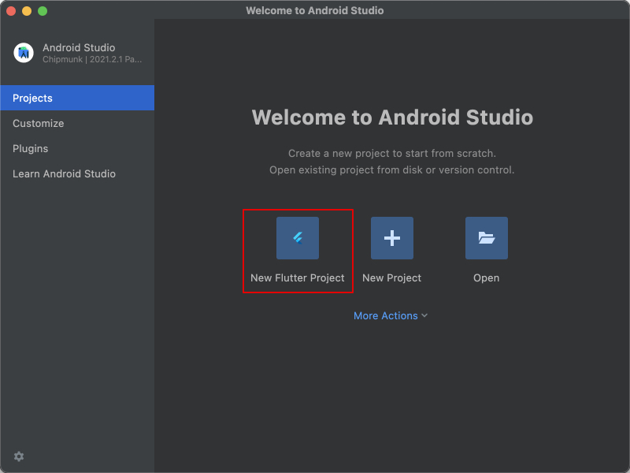  

`New Flutter Project` を選択します。  

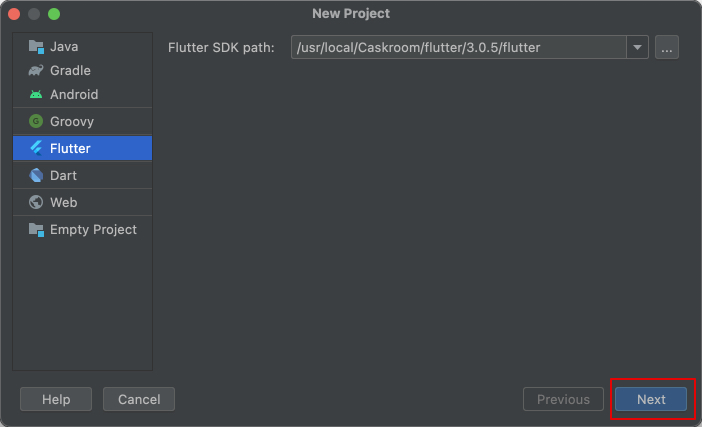  

`Flutter`, `Flutter SDK path`を選び、`Next`を押下。

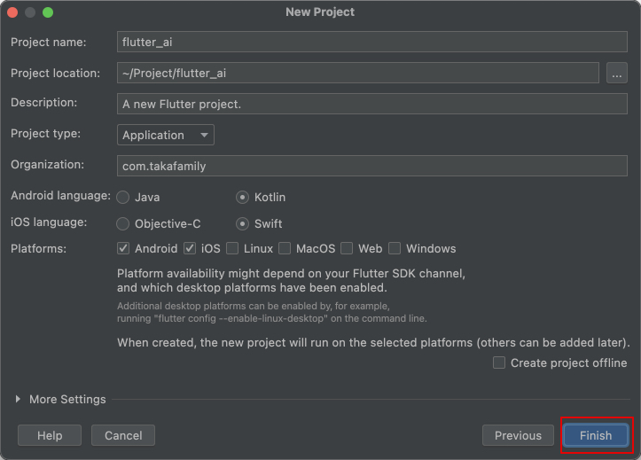  

key|val
---|---
Project name|flutter_ai
Project location|任意のフォルダを設定します。
Project type|Application
Organization|あなたが所属している、唯一のドメインを指定します。<br/>（独自ドメインが一般的）
Android language|Kotlin
iOS language|Swift
Platforms|Android, iOS<br/>（開発がMacの場合は両方、Windowsの場合はAndroidのみ)

上記設定後、`Finish`を押下。

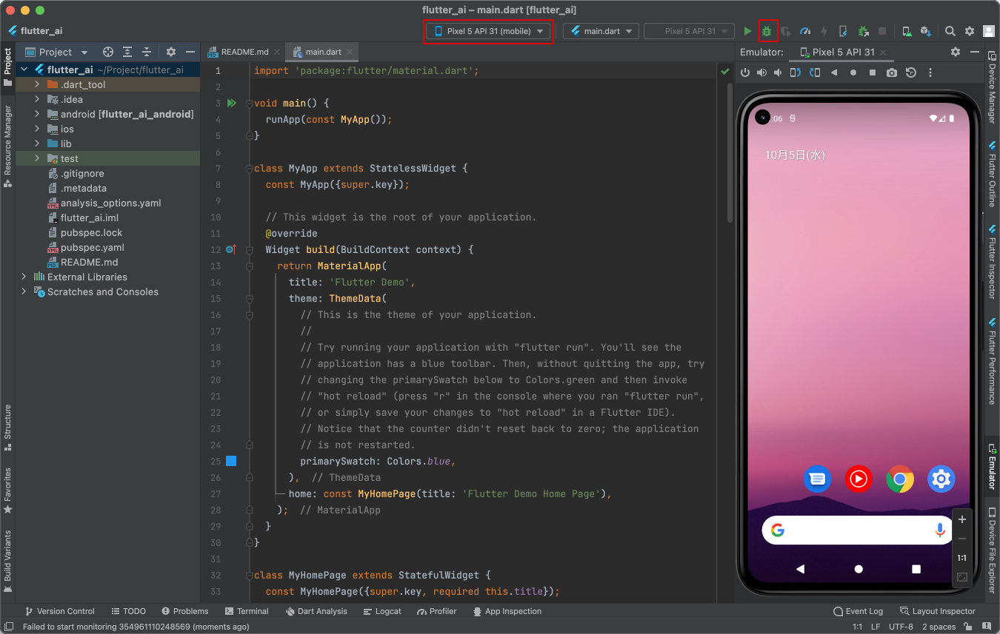  

Android Emulatorを起動し、デバッグボタンを押下する。  

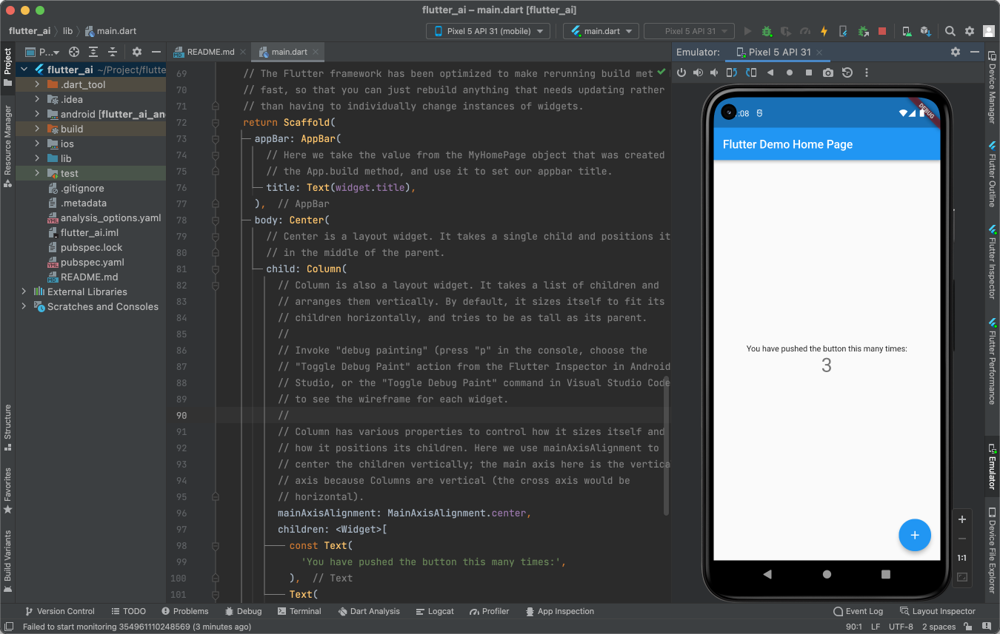  

初期サンプルアプリケーションが起動できました。  

## STEP2: カメラ撮影機能追加

ソースコードはこちら  
https://github.com/yasushikobe/flutter_ai/tree/v0.2

### 開発概説

カメラプラグインを導入します。  

Terminalより、

```cmd
flutter pub add image_picker
```

上記コマンドにより、`pubspec.yaml`が下記のように更新されます。  

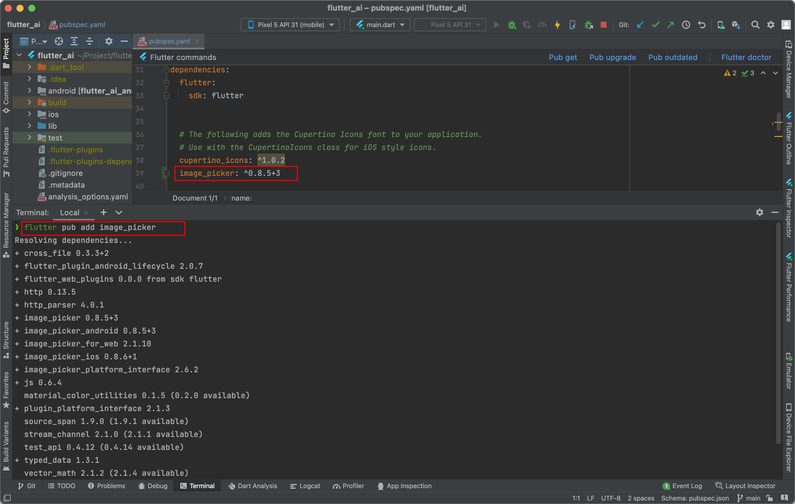  

android設定にカメラを許可設定を追加します。

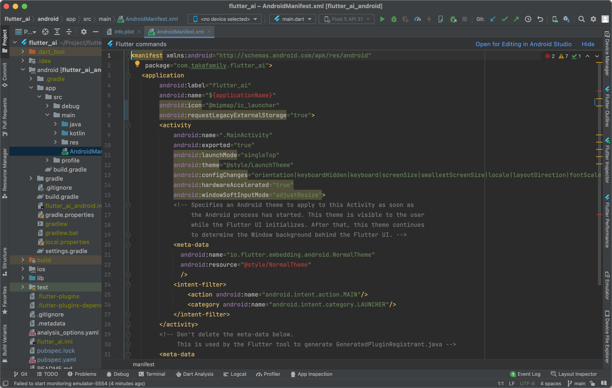  

iOS設定にカメラを許可設定を追加します。 (Macでの開発のみ)

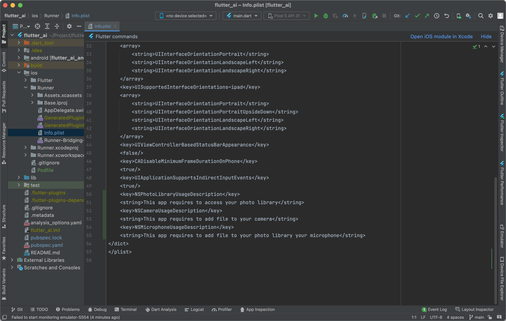  

アプリケーションコードを作成します。

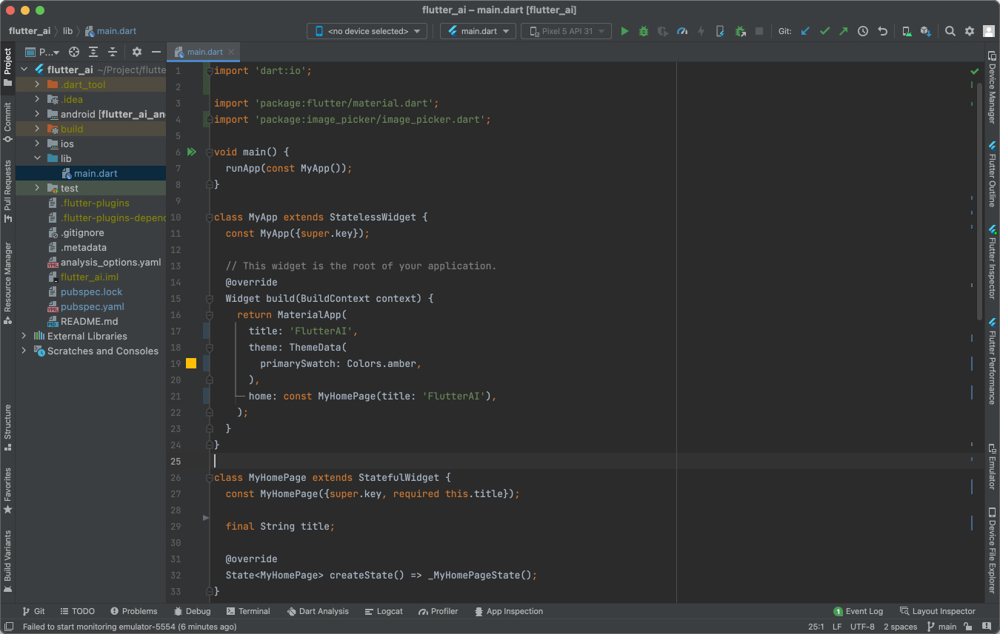  

#### <u>パッケージの取り込み</u>

Flutter開発用に前もって準備された部品群を取り込みます。  

```dart
//ファイル入出力
import 'dart:io';
//画面構成部品
import 'package:flutter/material.dart';
//カメラ部品
import 'package:image_picker/image_picker.dart';
```

#### <u>main 関数</u>

アプリの開始関数です。  
アプリケーションクラスを生成し、runApp メソッドに渡します。  

```dart
void main() {
  runApp(const MyApp());
}
```

#### <u>アプリケーションクラス</u>

アプリケーションクラスの定義です。  
状態を持たないクラスの場合は、StatelessWidgetを継承します。  
`build()`が必須定義のメソッドです。  
下記記述では、amber色のアプリケーション枠が描画され、アプリタイトルが設定されます。  
ページ詳細は、ページクラスに記述されます。  

```dart
class MyApp extends StatelessWidget {
  const MyApp({super.key});

  @override
  Widget build(BuildContext context) {
    return MaterialApp(
      title: 'FlutterAI',
      theme: ThemeData(
        primarySwatch: Colors.amber,
      ),
      home: const MyHomePage(title: 'FlutterAI'),
    );
  }
}
```

#### <u>ページクラス</u>

ページ構成を管理します。
StatefulWidgetから継承されているため、状態を持つことが許されます。  
createState()関数にて状態クラスを作成しています。  

```dart
class MyHomePage extends StatefulWidget {
  const MyHomePage({super.key, required this.title});
  final String title;

  @override
  State<MyHomePage> createState() => _MyHomePageState();
}
```

#### <u>ページ状態クラス</u>

ページの状態を管理します。  
下記例では、カメラ制御のコンポーネントと、撮影された画像データを状態（変数）として保持します。  
保持された状態は、初期起動時とsetState()関数実行時に、build()関数が実行されます。  
build()関数では、その状態に合わせた画面描画を行います。  
Scaffoldクラス内部では、画面コンポーネントが階層構造で管理されます。  
それぞれの画面コンポーネントでは、ユーザ操作に合わせたイベント処理を定義できます。  
下記の例では、 FloatingActionButtonを押されたときに、 pickImage() 関数が呼び出されます。  
pickImage()関数では、カメラ撮影画像データを取得し、状態変数を更新し、画面再描画を行います。  

```dart
class _MyHomePageState extends State<MyHomePage> {
  final picker = ImagePicker();
  File? _image;

  Future pickImage() async {
    final XFile? pickedFile =
        await picker.pickImage(source: ImageSource.camera);
    setState(() {
      if (pickedFile != null) {
        _image = File(pickedFile.path);
      }
    });
  }

  @override
  Widget build(BuildContext context) {
    return Scaffold(
      appBar: AppBar(
        title: const Text('FlutterAI'),
      ),
      body: Center(
        child: _image == null
            ? const Text('No image selected.')
            : Image.file(_image!),
      ),
      floatingActionButton: FloatingActionButton(
        onPressed: pickImage,
        child: const Icon(Icons.add_a_photo),
      ),
    );
  }
}

```

デバイスを選択し、デバッグボタンを押下します。  

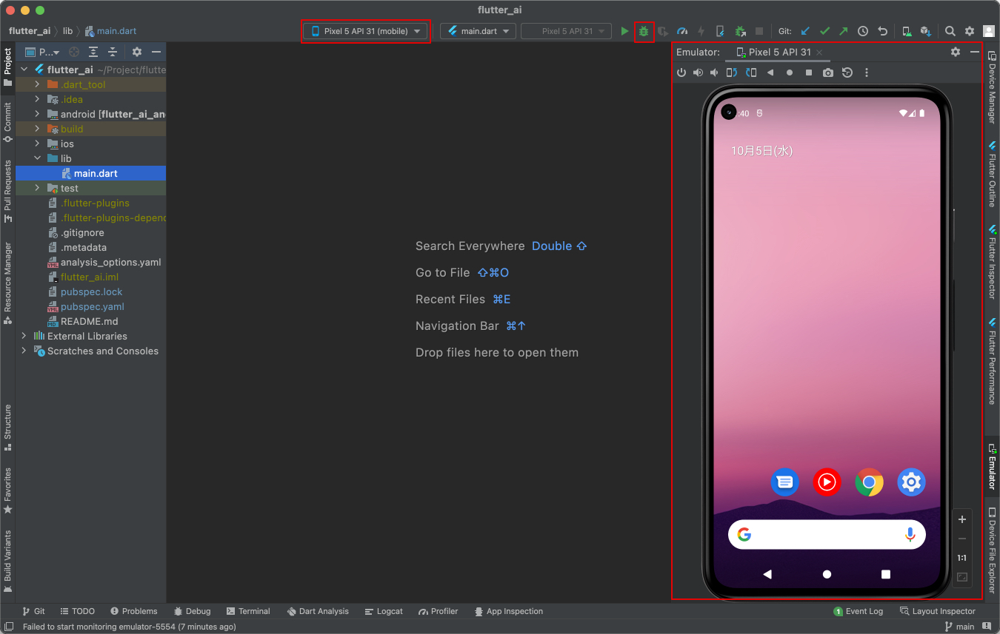  

android emulatorが起動します。  

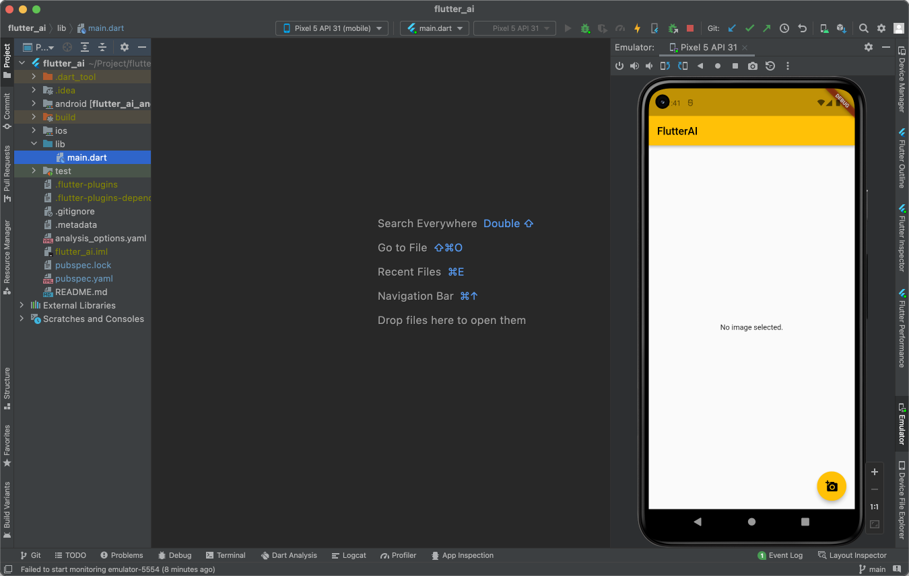  

右下のボタンを押すとカメラが起動されます。

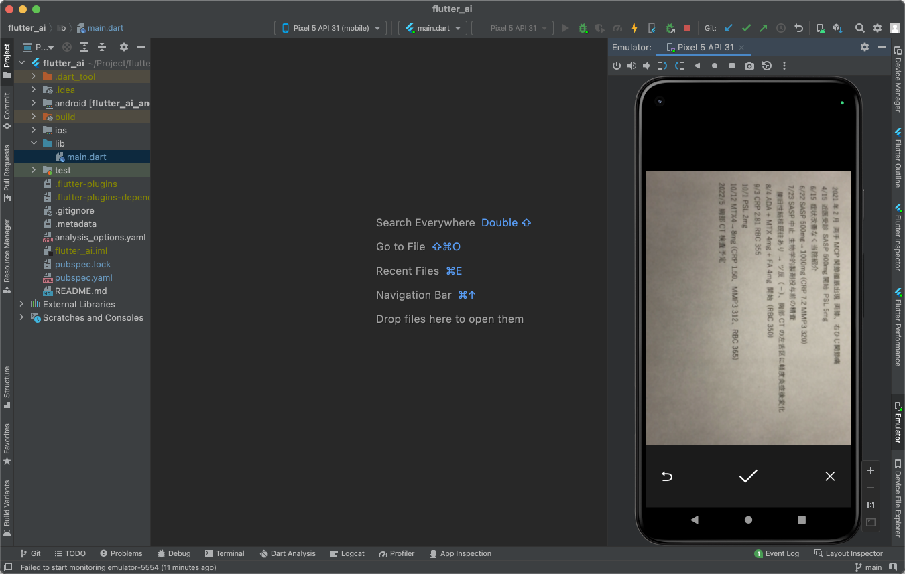  

撮影された画像が画面に反映されます。  
(Emulatorの場合、縦横判定ができない制限があります。)

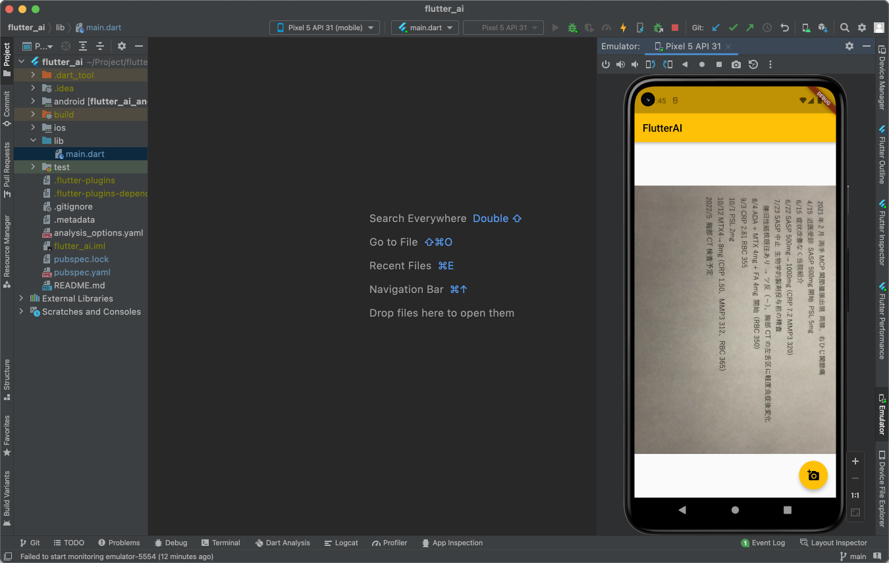  

## STEP3: OCR解析呼び出し

### package 追加

`yaml`, `http` コンポーネントを追加します。

```cmd
flutter pub add yaml
flutter pub add http
```

更新後の `pubspec.yaml`  

```yaml
name: flutter_ai
description: A new Flutter project.
publish_to: 'none' # Remove this line if you wish to publish to pub.dev
version: 1.0.0+1
environment:
  sdk: '>=2.18.2 <3.0.0'
dependencies:
  flutter:
    sdk: flutter
  cupertino_icons: ^1.0.5
  image_picker: ^0.8.6
  yaml: ^3.1.1
  http: ^0.13.5
dev_dependencies:
  flutter_test:
    sdk: flutter
  flutter_lints: ^2.0.1
flutter:
  uses-material-design: true
```

### OCR読み込み関数の追加

`lib/ocr.dart` ファイルを作成します。

```dart
/// 実行には、/lib/param.dart ファイルを作成する必要があります。
/// Azure Console Computer Vision の概要ページよりエンドポイント・キー情報を参照。
///
/// ```/lib/param.dart
/// const String endpoint = "https://.../"
/// const String apiKey = "xxxxxxxxxxxxxxxxxxx"
/// ```

//json変換
import 'dart:convert';
//バイナリリスト型
import 'dart:typed_data';
//Azure endpoint, key
import 'package:flutter_ai/param.dart';
//http query
import 'package:http/http.dart' as http;

//Azure computer vision url
const analyzeUrl = "${endpoint}vision/v3.2/read/analyze?language=ja";

//OCR解析クラス
Future<List<String>> analyze(Uint8List pngData) async {
  //Azure computer vision 解析依頼
  final resultLocation = await http.post(Uri.parse(analyzeUrl),
      headers: {
        "Content-Type": "image/png",
        "Ocp-Apim-Subscription-Key": apiKey,
      },
      body: pngData);
  final location = resultLocation.headers["operation-location"];
  List<dynamic> resultLines;
  while (true) {
    await Future.delayed(const Duration(milliseconds: 200));
    //Azure computer vision 結果取り出し
    final resultValueString = await http.get(
      Uri.parse(location!),
      headers: {"Ocp-Apim-Subscription-Key": apiKey},
    );
    final resultValue = jsonDecode(resultValueString.body);
    if (resultValue['status'] != "succeeded") continue;
    resultLines = resultValue['analyzeResult']['readResults'][0]['lines']
        .map((line) => line['text'].toString())
        .toList();
    break;
  }
  //複数行文字列情報を返却
  return resultLines.cast<String>();
}
```

### Azure設定ファイルの追加

lib/param.dartを追加  

```yaml
const String endpoint = "https://computer visionのendpoint url/";
const String apiKey = "computer visionのkey";
```

## STEP4: 仕上げ

完全なソースコードは
https://github.com/yasushikobe/flutter_ai


### main.dart

```dart
//ファイル処理
import 'dart:io';

//画面処理
import 'package:flutter/material.dart';

//OCR処理
import 'package:flutter_ai/ocr.dart';

//カメラ処理
import 'package:image_picker/image_picker.dart';

//画面動作状態
enum Mode {
  empty, //データなし
  picture, //写真データあり
  ocr, //ocrデータあり
}

//メイン処理
void main() {
  //アプリケーションクラスを稼働させる。
  runApp(const MyApp());
}

//アプリケーションクラス（状態なし）
class MyApp extends StatelessWidget {
  const MyApp({super.key});

  //MaterialApp形式で動作させる。
  @override
  Widget build(BuildContext context) {
    return MaterialApp(
      title: 'FlutterAI',
      theme: ThemeData(
        primarySwatch: Colors.amber,
      ),
      home: const MyHomePage(title: 'FlutterAI'),
    );
  }
}

//ページクラス（状態オブジェクトを保持する）
class MyHomePage extends StatefulWidget {
  const MyHomePage({super.key, required this.title});

  final String title;

  @override
  State<MyHomePage> createState() => _MyHomePageState();
}

//ページ状態クラス
class _MyHomePageState extends State<MyHomePage> {
  //カメラオブジェクト
  final picker = ImagePicker();

  //初期状態は、データなし状態に設定する。
  Mode mode = Mode.empty;

  //カメラ撮影した画像ファイル
  File? _image;

  //複数行にデコードされたOCRテキスト
  List<String> _lines = [];

  //写真を撮影する。
  Future pickImage() async {
    //カメラデバイスより画像情報を取得する。
    final XFile? pickedFile =
        await picker.pickImage(source: ImageSource.camera);
    //画像情報が存在した場合、ファイルオブジェクトに変換する。
    if (pickedFile != null) {
      _image = File(pickedFile.path);
      mode = Mode.picture;
    } else {
      mode = Mode.empty;
    }
    //画面更新を行う。
    setState(() {});
  }

  //OCR解析を行う。
  Future ocr() async {
    //画面操作ロック
    showWaitDialog();
    try {
      //バイナリデータに変換する。
      final imageData = _image!.readAsBytesSync();
      //Azure computer visionを呼び出す。
      _lines = await analyze(imageData);
      //画面モードをocrデータありにする。
      mode = Mode.ocr;
      //画面更新を行う。
      setState(() {});
    } finally {
      //画面操作アンロック
      hideWaitDialog();
    }
  }

  //画面初期化
  Future clear() async {
    //画像ファイル初期化
    _image = null;
    //ocrデータ初期化
    _lines = [];
    //画面モードをデータなしに設定
    mode = Mode.empty;
    //画面更新を行う。
    setState(() {});
  }

  //画面操作ロック
  void showWaitDialog() {
    showGeneralDialog(
      context: context,
      barrierDismissible: false,
      transitionDuration: const Duration(milliseconds: 250),
      barrierColor: Colors.black.withOpacity(0.5),
      pageBuilder: (BuildContext context, Animation animation,
          Animation secondaryAnimation) {
        return const Center(
          child: CircularProgressIndicator(),
        );
      },
    );
  }

  //画面操作アンロック
  void hideWaitDialog() {
    Navigator.pop(context);
  }

  @override
  Widget build(BuildContext context) {
    return Scaffold(
      //画面タイトル
      appBar: AppBar(
        title: const Text('FlutterAI'),
      ),
      body: Center(
        //画面本体（画面モードにより描画する情報を切り替える）
        child: mode == Mode.empty
            ? const Text('No image selected.')
            : mode == Mode.picture
                ? Image.file(_image!)
                : Container(
                    alignment: Alignment.topLeft, //任意のプロパティ
                    margin: const EdgeInsets.all(10),
                    width: double.infinity,
                    child: Text(_lines.join('\n'))),
      ),
      //初期化・カメラ撮影・OCR変換ボタン
      floatingActionButton: Column(
        verticalDirection: VerticalDirection.up,
        mainAxisSize: MainAxisSize.min,
        children: [
          FloatingActionButton(
            onPressed: pickImage,
            child: const Icon(Icons.add_a_photo),
          ),
          Visibility(
            visible: mode == Mode.picture,
            child: Container(
              margin: const EdgeInsets.only(bottom: 8.0),
              child: FloatingActionButton(
                onPressed: ocr,
                child: const Icon(Icons.text_fields),
              ),
            ),
          ),
          Visibility(
            visible: mode == Mode.ocr || mode == Mode.picture,
            child: Container(
              margin: const EdgeInsets.only(bottom: 8.0),
              child: FloatingActionButton(
                onPressed: clear,
                child: const Icon(Icons.clear),
              ),
            ),
          ),
        ],
      ),
    );
  }
}
```
