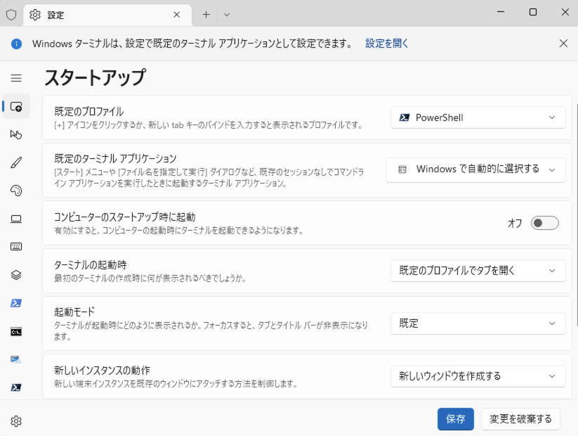
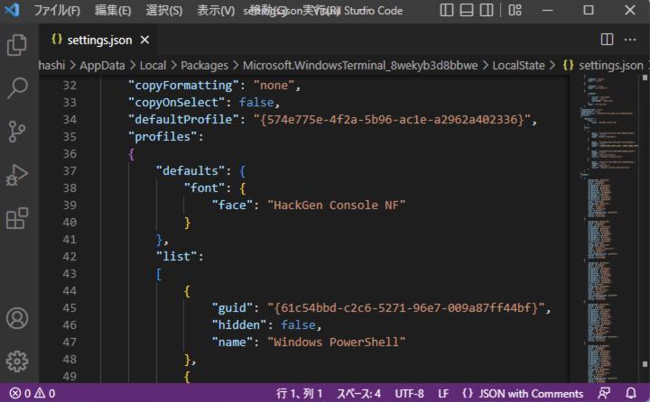
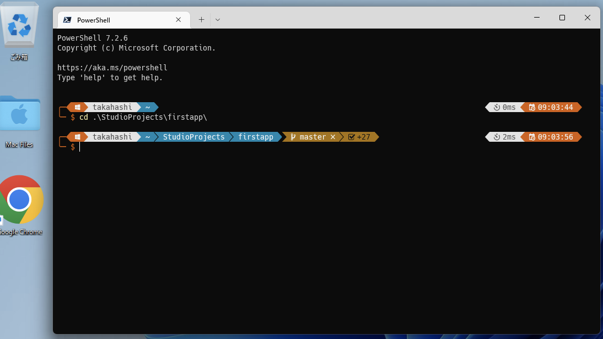
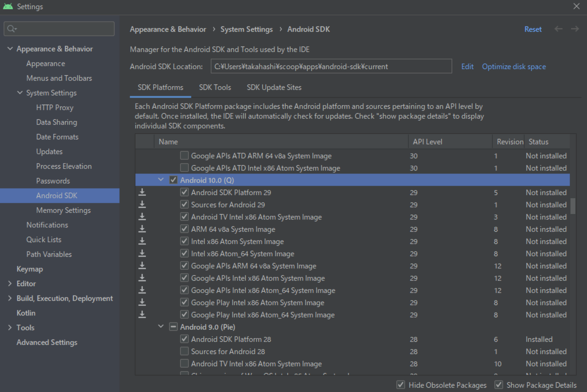
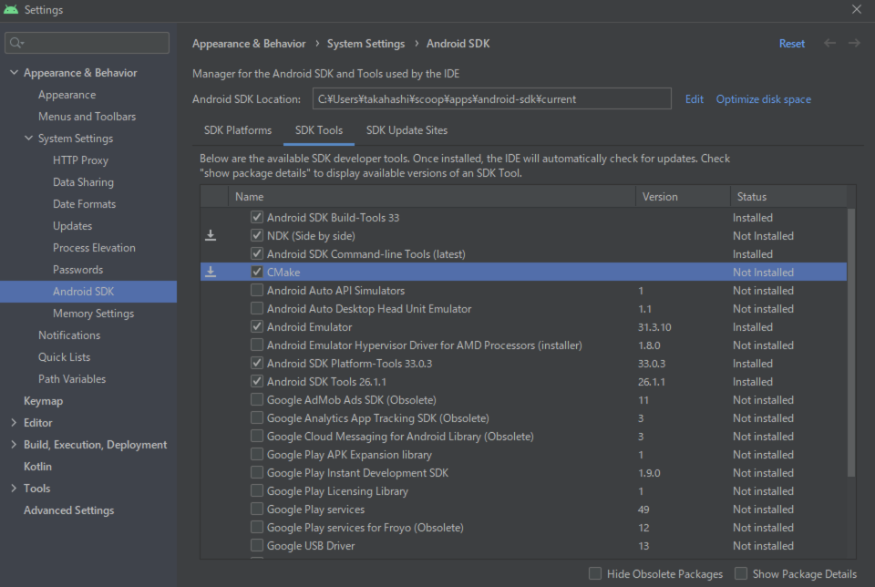
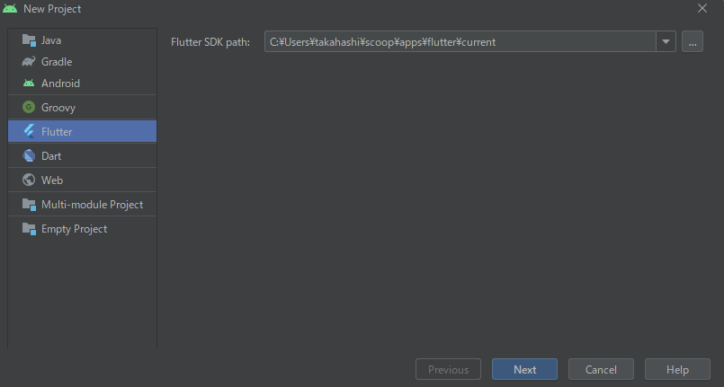
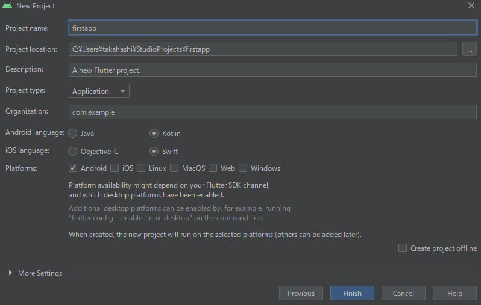
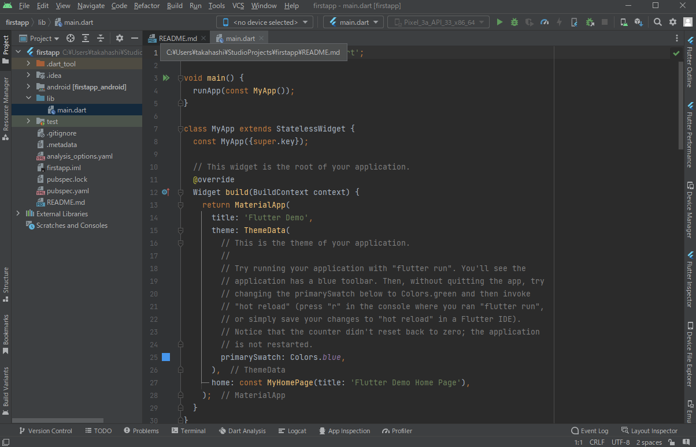
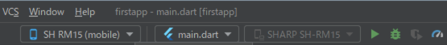
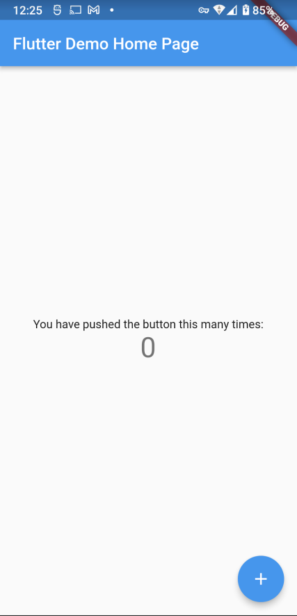

# 開発環境

## 実行環境要件

項目|内容
---|---
CPU|Intel Virtualization Technology（VT、VT-x、vmx）<br/>または<br/>AMD Virtualization（AMD-V、SVM）<br/>拡張機能搭載CPU
SSD/HDD空き容量|40GB以上
MEMORY|8GB以上
Androidスマホ|Android8.0以上

## ベース環境セットアップ

[Microsoftアプリストア（アプリインストーラー）](https://apps.microsoft.com/store/detail/%E3%82%A2%E3%83%97%E3%83%AA-%E3%82%A4%E3%83%B3%E3%82%B9%E3%83%88%E3%83%BC%E3%83%A9%E3%83%BC/9NBLGGH4NNS1?hl=ja-jp&gl=jp)より、アプリインストーラーの導入（更新）を行います。  

`Windowsターミナル`を管理者モードで起動する。  
PowerShellがコンソールに表示されていることを確認します。  

```powershell
winget source update
winget install Microsoft.PowerShell --scope machine
winget install Microsoft.WindowsTerminal
winget install Google.Chrome --scope machine
winget install -q vscode --scope machine
```

```powershell
Set-ExecutionPolicy Bypass `
  -Scope Process `
  -Force; [System.Net.ServicePointManager]::SecurityProtocol = `
    [System.Net.ServicePointManager]::SecurityProtocol `
  -bor 3072; `
  iex ((New-Object System.Net.WebClient).DownloadString(`
    'https://chocolatey.org/install.ps1'`
  ))
choco install font-hackgen-nerd
```

ここでマシン再起動を行います。（下記コマンド）

```powershell
shutdown /r /t 0
```

## Windowsターミナル設定

`Windowsターミナル`を起動し、設定画面を開きます。

  

`規定のプロファイル`を黒背景アイコンのPowerShellに設定し、`保存`ボタンを押す。

## Windows Terminal Font設定

設定メニューより、`JSONファイルを開く`を選択します。

  

```json
{
    "profiles": 
    {
        "defaults": {
            "font": {
                "face": "HackGen Console NF"
            }
        },
    }
}
```

`profiles` - `defaults` - `font` オブジェクトを追記します。

```powershell
winget install Git.Git --scope machine
winget install JanDeDobbeleer.OhMyPosh -s winget --scope machine
code $PROFILE
```

VisualStudio Codeが起動されます。
その際に、次のPlug-inを導入しても良い。

* PowerShell
* Japanese Language Pack for Visual Studio Code

下記ファイル(Microsoft.PowerShell_profile.ps1)を保存する。

```powershell
oh-my-posh init pwsh `
  --config "$env:POSH_THEMES_PATH\quick-term.omp.json" `
  | Invoke-Expression
```

このようなPowerShellが起動できるようになりました。　　

  

## Android Studio

```powershell
Set-ExecutionPolicy RemoteSigned -scope CurrentUser
iwr -useb get.scoop.sh | iex
scoop bucket add extras
scoop bucket add java 
scoop install temurin8-jdk
scoop install dart
scoop install android-sdk
scoop install flutter
flutter doctor --android-licenses
winget install Google.AndroidStudio --scope machine
```

Android Studioを起動する。

### Plugins 追加

* Dart
* Flutter

### Android SDK 追加

* Android Tiramisu (Tiramisu)
  
    

* NDK, Cmake
  
    

### Visual Studio 追加

https://visualstudio.microsoft.com/ja/downloads/ よりコミュニティバージョンのインストーラーをダウンロード  
ダウンロードした``VisualStudioSetup.exe``を実行する。  
下記のワークロードを選択する。  

* C++によるデスクトップ開発  

## 開発環境検証

powershellより ``flutter doctor -v``を実行する。  

```console
$ flutter doctor -v
[✓] Flutter (Channel stable, 3.3.2, on Microsoft Windows [Version 10.0.22000.978], locale ja-JP)
    • Flutter version 3.3.2 on channel stable at C:\Users\takahashi\scoop\apps\flutter\current
    • Upstream repository https://github.com/flutter/flutter.git
    • Framework revision e3c29ec00c (4 days ago), 2022-09-14 08:46:55 -0500
    • Engine revision a4ff2c53d8
    • Dart version 2.18.1
    • DevTools version 2.15.0

[✓] Android toolchain - develop for Android devices (Android SDK version 33.0.0)
    • Android SDK at C:\Users\takahashi\scoop\apps\android-sdk\current
    • Platform android-33, build-tools 33.0.0
    • ANDROID_HOME = C:\Users\takahashi\scoop\apps\android-sdk\current
    • Java binary at: C:\Program Files\Android\Android Studio\jre\bin\java
    • Java version OpenJDK Runtime Environment (build 11.0.13+0-b1751.21-8125866)
    • All Android licenses accepted.

[✓] Chrome - develop for the web
    • Chrome at C:\Program Files\Google\Chrome\Application\chrome.exe

[✓] Visual Studio - develop for Windows (Visual Studio Community 2022 17.3.4)
    • Visual Studio at C:\Program Files\Microsoft Visual Studio\2022\Community
    • Visual Studio Community 2022 version 17.3.32901.215
    • Windows 10 SDK version 10.0.19041.0

[✓] Android Studio (version 2021.3)
    • Android Studio at C:\Program Files\Android\Android Studio
    • Flutter plugin can be installed from:
      🔨 https://plugins.jetbrains.com/plugin/9212-flutter
    • Dart plugin can be installed from:
      🔨 https://plugins.jetbrains.com/plugin/6351-dart
    • Java version OpenJDK Runtime Environment (build 11.0.13+0-b1751.21-8125866)

[✓] VS Code, 64-bit edition (version 1.71.2)
    • VS Code at C:\Program Files\Microsoft VS Code
    • Flutter extension can be installed from:
      🔨 https://marketplace.visualstudio.com/items?itemName=Dart-Code.flutter

[✓] Connected device (3 available)
    • Windows (desktop) • windows • windows-x64    • Microsoft Windows [Version 10.0.22000.978]
    • Chrome (web)      • chrome  • web-javascript • unknown
    • Edge (web)        • edge    • web-javascript • Microsoft Edge 105.0.1343.42

[✓] HTTP Host Availability
    • All required HTTP hosts are available

• No issues found!
```

このように、``No issues found!``が表示されれば問題なし。  

## サンプルアプリ作成

* Android Studio起動
* New Flutter Projet 選択
  
    

  key|val
  ---|---
  Flutter SDK path|C:¥Users¥xxxx¥scoop¥flutter¥current

* Flutter
  
    

  key|val
  ---|---
  Project name|firstapp
  Platform|Android

サンプルソースが作成されます。  
  

## Androidスマホの接続・デバッグ

* 設定 - デバイス情報 を表示する。  
* ビルド番号 を７回連続でタップする。  
* 設定 - システム - 開発者向けオプション を表示する。  
  key|val
  ---|---
  開発者向けオプションの使用|オン
  USBデバッグ|オン

上記設定ののち、USB-CケーブルをPCに接続する。

  

ケーブル接続後、ツールバーに接続したAndroid機種名がエントリーされる。  
その状態で、デバッグボタンを押す。（バグアイコン）  

  

アプリが自動的に起動されます。  
